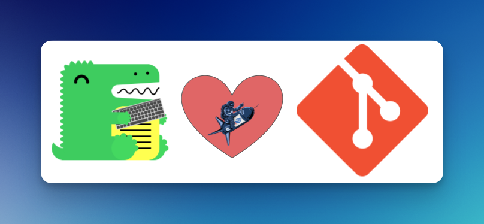

# Docusarus Versioning with Git - Template

This is a template for a Docusarus site that uses Git for versioning. We recommend you read the blog post [_When Docs and a Dinosaur Git Along_]() to understand the motivation behind this template and why we at Spectro Cloud chose to use Git for versioning.

Additionally, we recommend you start the local development server and read the Versioning Tips & Tricks section to learn more about this versioning approach. We have also included a [FAQ section](#frequently-asked-questions-faq) to address common questions and issues.

<p align="center">
  
</p>

> [!IMPORTANT]
> This repository will not be actively maintained and was created for demonstration purposes only. We recommend you use this repository as a starting point to help you spark ideas on implementing versioning in your Docusarus site.

## Getting Started

To use this template, click the `Use this template` button at the top of the repository. This will create a new repository in your account with the same files and directory structure as this repository. Use the following steps to get started with your new repository.

Choose between the Docker or non-Docker setup. The Docker setup is recommended for a consistent development environment.

### Prerequisites

- [Node.js](https://nodejs.org/en/download) v18.0.0 or higher
- [Make](https://www.gnu.org/software/make/) installed on your system.
- [Git](https://git-scm.com/) installed on your system.
- [jq](https://stedolan.github.io/jq/) installed on your system.

## Setup without Docker

1. Issue the command `make init`

2. Issue `make versions` to generate all the versioned content.

3. Issue `make start` to start the development server.

4. Issue `make build` to build the site so that you can become familiar with the build process. If you want to preview the build, issue the command `npm run serve`.

## Setup with Docker

1. Issue the command `make build-docker` to build the Docker image.
2. Issue the command `make run-docker` to start the development server and access a shell in the container.
3. From inside the container shell, issue `make versions` to generate all the versioned content.

4. Next, issue the command `make start` to start the development server.

5. Use the command `make build` to build the site so that you can become familiar with the build process. If you want to preview the build, issue the `npm run serve` command.

To exit the container, issue the command `exit` or press `Ctrl + C`.

> [!TIP]
> Issue the command `make clean-versions` to remove all the versioned content.

## Create a New Version

To create a new version, use the git command `git checkout -b <name-of-branch>`. This will create a new branch and switch to it. Once you are inside the new version branch, start making changes and commit them.

We recommend you settle on a naming pattern for your version branches. This example repository uses the pattern `version-<version-number>`. For example, `version-1-1`. If you go with a different pattern, update the [versions.sh](./scripts/versions.sh) script to reflect the new pattern.

## Frequently Asked Questions (FAQ)

### ❓ How do I preview all versioned content locally?

_Use the command `make versions` to generate all the versioned content. Then, use the `make start` command to start the development server. You can also preview the build using the command `make build` and then issue the command `npm run serve`._

### ❓ How do I remove all versioned content?

\_Use the command `make clean-versions` to remove all the versioned content. This command removes the `versioned_docs` and `versioned_sidebars directories`. It also removes the `versions.json` file, changes to the `docusaurus.config.js` file, and the `static/robots.txt` file.

### ❓ How do you backport changes to older versions?

You have a couple of options to backport changes to older versions.

1. Create a new branch from the default branch, make the changes, commit, and create a pull request. Add the label `auto-backport`, and select the labels that match the versions to which you want to backport the changes. The [backport.yml](https://github.com/spectrocloud/docusarus-versioning-template/blob/main/.github/workflows/backport.yaml) workflow will automatically create a backport PR for each version. Merge the PRs to backport the changes.

2. You can use the `git cherry-pick` command to pick a commit from a newer version and apply it to an older version. This approach is more common when the backport workflow cannot create a backport PR due to merge conflicts.

3. If the change applies only to a specific version, you can commit it directly in the version branch. Ideally, you do this through a pull request so that the change is reviewed.

### ❓ A backport PR failed to get created. What do I do?

_The backport PR failed to get created because of a merge conflict. The simplest approach is to switch to the version branch and do a `git cherry-pick` of the commit that introduced the change. For example, if the merged PR created commit `1dee9d31fcf651ac5c0428254fd38b4783b94b53`, you would issue `git cherry-pick 1dee9d31fcf651ac5c0428254fd38b4783b94b53` and resolve any conflicts, ideally from an editor. Addresses the issues, commits the changes, and pushes them up. We prefer to create a new branch when doing cherry-picks versus doing it from the version branch. We then merge the PR into the version branch to ensure we are not introducing any changes that could break the build._

### ❓ I started the local development server, but I don't see the versioned content. What's wrong?

_You need to generate the versioned content first. Use the command `make versions` to generate all the versioned content. Then, use the command `make start` to start the development server._

### ❓ I tried to generate the versioned content, but I got an error. What's wrong?

Ensure there are no uncommitted changes in your current branch. The [versions.sh](<[./scripts/versions.sh](https://github.com/spectrocloud/docusarus-versioning-template/blob/main/scripts/versions.sh)>) script will check out each version branch and generate the versioned content for that respective branch. If there are uncommitted changes, the script will fail due to get errors.

### ❓ How come this is not for Docusaurs with TypeScript?

There are no reasons; it's just not the configuration we use for Docusarus at Spectro Cloud. But there are no reasons why you can't use TypeScript with this template. However, you will need to change the configuration files to use TypeScript.

### ❓ I have multiple plugins on my Docusaurus site. How do I handle this?

Multiple plugins can be added to this solution. The most important thing is to ensure the `versions.sh` and the `update_docusarus_config.js` are updated to target these plugins. For example, if you have a plugin called `api`, then in the `versions.sh` you would add an entry to create the versioned content for the `api` plugin.

```shelll
# Run the npm command
echo "Running: npm run docusaurus docs:version $extracted_versionX"
npm run docusaurus docs:version $extracted_versionX

# Generate the API docs
echo "Running: npm run docusaurus docs:version:api $extracted_versionX"
npm run docusaurus docs:version:api $extracted_versionX
```

You would have to make sure that the required temporary folders and files are created as well in the `versions.sh` script. Check out our production [`versions.sh`](https://github.com/spectrocloud/librarium/blob/master/scripts/versions.sh) script for an example of how we handle multiple plugins.

The `update_docusarus_config.js` script must also be updated to handle the multiple plugins. For example, if you have a plugin called `api`, then you would need to add an entry to the `update_docusarus_config.js` script to update the `api` plugin. Check out our production [`update_docusarus_config.js`](https://github.com/spectrocloud/librarium/blob/master/scripts/update_docusarus_config.js) script. In our production script, we have a function for each plugin that we want to update.

```js
const apiDocsVersionsObject = findApiDocsPluginVersionsObject();
if (apiDocsVersionsObject) {
  updateVersionsObject(apiDocsVersionsObject);
}
```

The `findApiDocsPluginVersionsObject` locates the `api` plugin object in the `docusaurus.config.js` file. The `updateVersionsObject` function updates the `api` plugin object with the versioned content. We use the `versionsOverride.json` file to override the `label`, `version`, and `banner` properties.

For example, in our Spectro Cloud production's site `version-3-4` branch we change the `label` to display `v3.4.x and prior`. This is the value we use in the `versionsOverride.json` file to override the default behavior.

```json
[
  {
    "version": "3.4.x",
    "banner": "none",
    "label": "v3.4.x and prior"
  }
]
```

### ❓ Do I need to create versioned content in every build?

The short answer is no, and it's also not something we recommend, especially for larger documentation sites. We recommend you only generate the versioned content when you need to preview it locally or when you are publishing content to production.

Use the `make versions` command to preview versioned content locally. This way, you can generate the versioned content when you need it and not have to worry about it being generated every time you build the site.

The versioning content is only generated after you have merged a PR into the default branch. Reviewing the GitHub Actions [release.yaml](https://github.com/spectrocloud/docusarus-versioning-template/blob/main/.github/workflows/release.yaml) workflow file, you will notice that the `make versions-ci` command is issued before the `make build` command.

### ❓ How do you manage `robots.txt` for the documentation site?

We use the `scripts/generate_robots.sh` script to generate the `robots.txt`. The script is triggered by the `scripts/version.sh` script.

```txt
User-agent: *
Disallow: /4.2.x/
Disallow: /4.1.x/
Allow: /$
Sitemap: https://docs.spectrocloud.com/sitemap.xml
```

We use the `Disallow` directive to prevent search engines from indexing the versioned content. We use the `Allow` directive to allow search engines to index the root of the documentation site. The disallow matches the slug of the versioned content. For example, `Disallow: /4.2.x/` prevents search engines from indexing the `4.2.x` versioned content.

Because we are creating new releases and versions frequently, we chose to automate the generation of the `robots.txt` file. This way, we don't have to worry about manually updating the `robots.txt` file every time we create a new version.

### ❓ Will this affect custom components and styles?

Most of the time, the answer is no. However, if you are backporting content that requires a custom component or style, you will need to ensure that the component or style is available in the version branch. If the component or style is not available, you will need to backport the component or style to the version branch.

### ❓ I am ready to archive a version branch and use an external URL. How do I do this?

First, add an entry in the [**archiveVersions.json**](<[./archiveVersions.json](https://github.com/spectrocloud/docusarus-versioning-template/blob/main/archiveVersions.json)>) for the branch you want to archive and no longer include in the build. Below is an example of our production configuration.

```json
{
  "v4.0.x": "https://version-4-0.legacy.docs.spectrocloud.com",
  "v3.4.x and prior": "https://version-3-4.legacy.docs.spectrocloud.com"
}
```

The next step is to update **versions.sh** script and specify the version branch to skip. Open the file and navigate to line `28`. Add your version branch in the `exclude_branches` variable.

```shell
exclude_branches=("version-1-0 version-1-1")
```

Save your changes and commit them to your main branch. Next time you issue `make versions`, the archived version will no longer be part of the build. Docusaurs will still display the version branch in the version drop-down menu but it will now be an external URL.

### ❓ I noticed you squash commits. How come?

When it comes to backporting, it's easier to only backport a single commit versus a set of commits. This is especially true when the backport actions are unable to create a pull request due to merge conflicts. In those scenarios, you have to cherry-pick. We prefer to cherry-pick a single commit.
